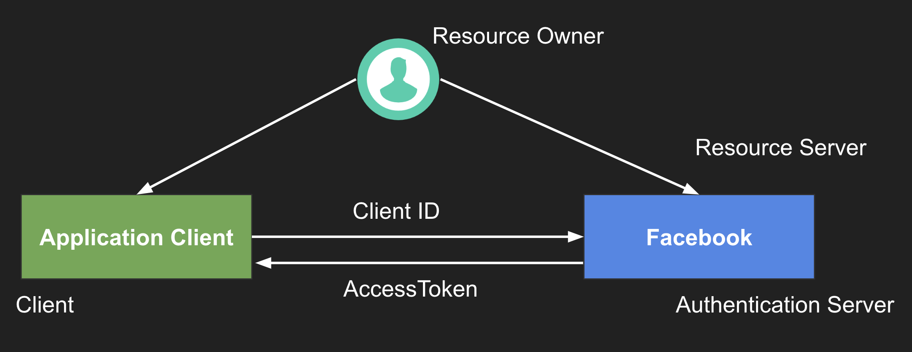

# Spring Boot Facebook Login example

This example is based on Spring Boot's Facebook login demo

## Architecture

## Version
- Spring Boot 2.2.1
- Spring Security 2.2.0
- Spring OAuth2 Auto Configure 2.2.0
- Webjars Jquery 3.4.1
- Webjars Bootstrap 4.3.1

## Notes
- `http://localhost:8080/` - Will show the Login here option and authenticates and displays user information from Facebook
- `application.yml` - contains API information and can be changed for your Facebook API.
- `index.html` - contains the code for displaying the user information using Jquery.